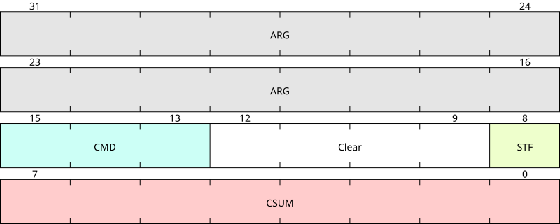
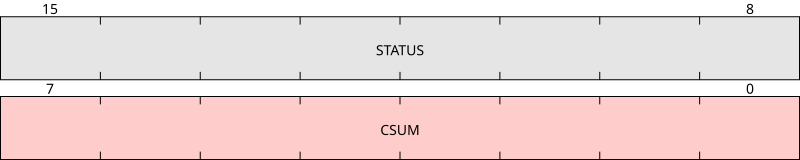
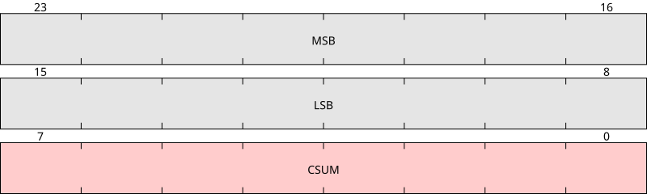

# Software

## Command Frame

4-byte command frames are sent from the programmer to the module.

- ARG: [31:16]: target argument based on command
  - (S): target address
  - (P): nil
  - (R): nil
  - (W): target address word content
  - (C): length of address range. Number includes the final byte. BE, obviously, so e.g. 0x01 0x00 is 256 bytes, whereas 0x00 0x00 "does nothing".

- CMD: [15:13]: command
  - 0x0: (X) no-op for resetting command stream. If H8 target misses a byte and becomes unaligned, you can send up to QTY4 of these one at a time and wait for a bad checksum.
  - 0x1: (S) seek to address, obligatorily word-aligned
  - 0x2: (P) show current address
  - 0x3: (R) read word at current address, and advance one word
  - 0x4: (W) write and verify word at current address, and advance one word
  - 0x5: (C) read checksum over address range

- Clear: [12:9]: default 0b0000; reserved for now for extra bits for future command variants.

- STF: [8]: stuff bit, used to ensure checksum is always odd, EXCEPT when sending 0x0 to reset the command bytestream.

- CSUM: [7:0]: frame checksum.

## Response Frame
The response from the module to the programmer is either two or three bytes; the last byte is the frame checksum.

### X, W commands

Format is two-bytes total:

- [15:8] is STATUS:
  - 0b00000000 if OK,
  - 0b00000001 if whole No-op command received (0x00 0x00 0x00 0x00),
  - 0b01010101 if RX checksum error,
  - 0b11111111 if Not OK.
- [7:0] is response frame checksum.

### R, C, P and S commands

Format is three-bytes total:

- R: [23:16] is MSB content, [15:8] is LSB word content.
- C: [23:16] and [15:8] are MSB and LSB of two-byte additive checksum of memory range, respectively.
- P: [23:16] and [15:8] are MSB and LSB of current address, respectively.
- S: [23:16] and [15:8] are MSB and LSB of moved-to address, respectively.
  - S is handled more carefully, as seeking to the wrong address and tripping over an unintentionally-correct checksum is not something we can ever afford.
- [7:0] is frame checksum.

# Hardware

## Hardware on BCM and MCM

### CN3 - Debug connector
- [x] GND: CN3@5 (MCM@A24(LG1)) https://www.insightcentral.net/posts/1533658/
- Serial: https://www.insightcentral.net/threads/dumping-reverse-engineering-insight-g1-bcm-and-mcm-firmare.130914/page-5?post_id=1533658#post-1533658
  - [x] TX: CN3@4 (H8@103(RXD1)), https://www.insightcentral.net/posts/1533431/
  - [x] RX: CN3@10 (H8@102(TXD1))
- [x] VBU: MCM@B10 (and nowhere else)
  - Needed as backup voltage for integrated watchdog to work: https://www.insightcentral.net/posts/1533785/
- [ ] LAT: CN3@9 https://www.insightcentral.net/posts/1533658/
  - [x] Cannot verify -- must do so experimentally as I don't remember the exact latch circuit
- [x] VCC: CN3@3 (IC22 (MCM) or IC3 (BCM)) VCC in: https://www.insightcentral.net/threads/dumping-reverse-engineering-insight-g1-bcm-and-mcm-firmare.130914/page-5?post_id=1534290#post-1534290
- [x] VPP: CN3@8 https://www.insightcentral.net/posts/1534290/
- [x] MD2: CN3@2
  - https://www.insightcentral.net/threads/dumping-reverse-engineering-insight-g1-bcm-and-mcm-firmare.130914/page-4?post_id=1533431#post-1533431
